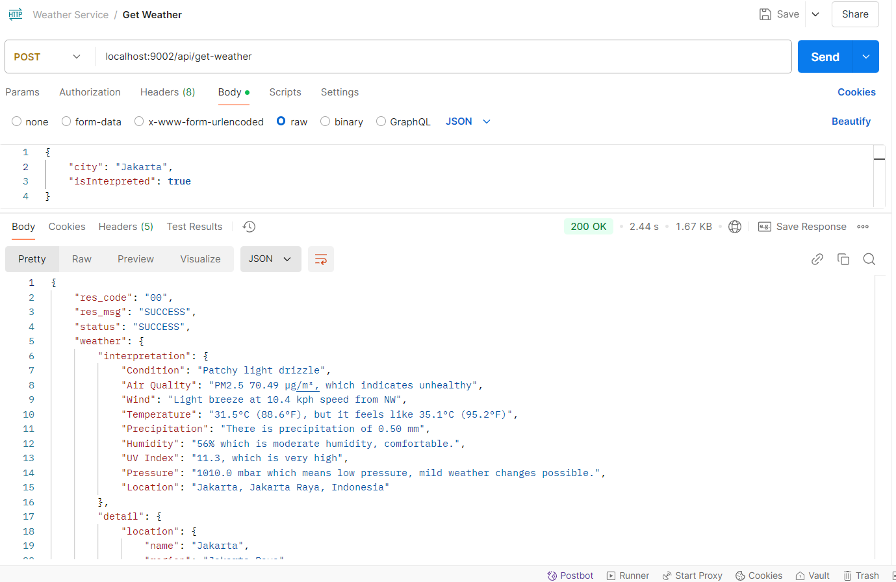
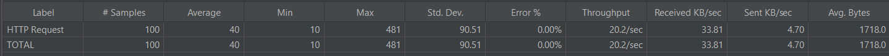
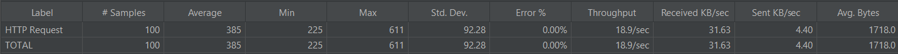

# weather-service
*Stay sync with the weather!*  
This project is developed in Java and uses [Redis](https://redis.io/) to store the weather data fetched from [WeatherAPI](https://www.weatherapi.com)  for a specific period. This enables quicker retrieval of weather information for the same city in future requests.  
This service also interprets the weather data, making it easier for users to understand.   
 

### How effective is Redis in speeding up processing time?
I tested it using [Apache JMeter](https://jmeter.apache.org/) with 100 threads and a 5-second ramp-up period.  
- *Test results from JMeter when Redis is used*  

- *Test results from JMeter when Redis isn't used in the process.*  
  

The average processing time is **9.x times faster** when Redis is used. This not only saves time but also reduces costs, especially when dealing with API billing that charges based on the number of requests.

## License
**All rights are reserved.** You may not use, distribute, or modify the code without explicit permission from the author.
